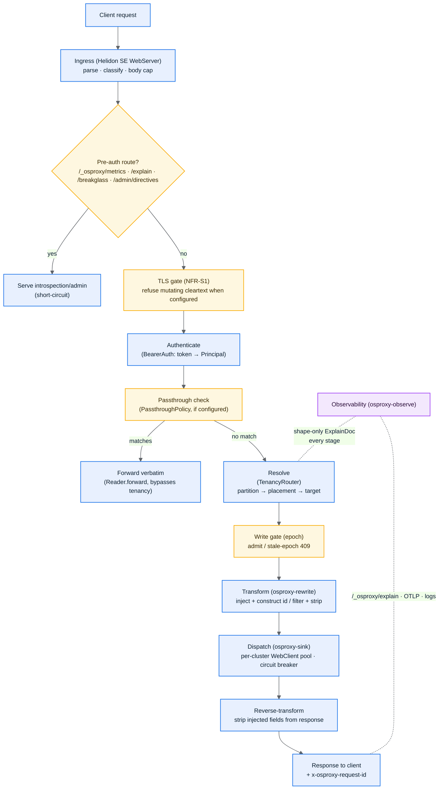
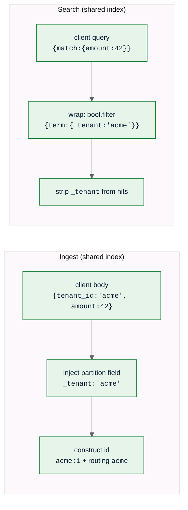
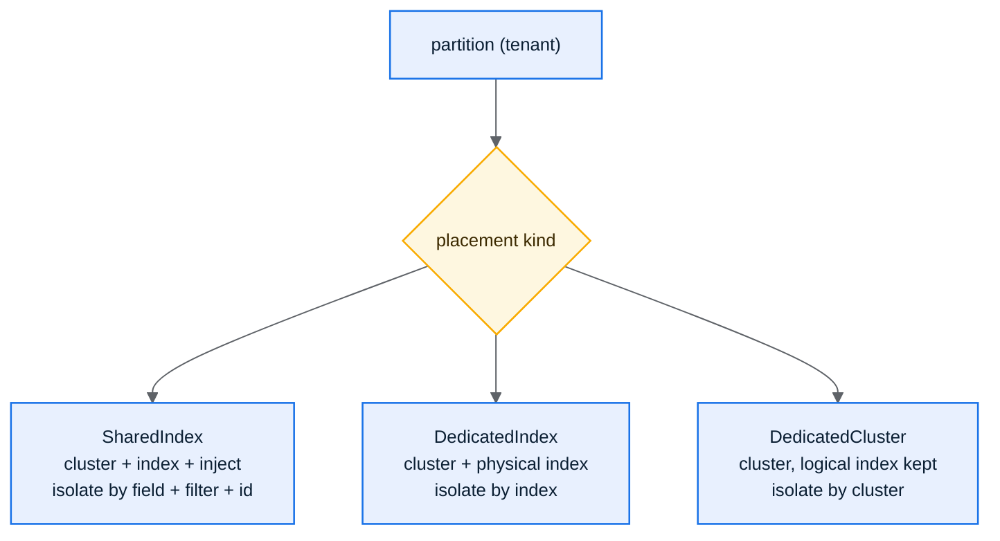

osproxy-java is a Gradle multi-module library and a reference binary
(`osproxy-server`). You implement the SPI; the engine runs each request
through a fixed pipeline (`Pipeline.handle`). Nothing on the hot path uses
reflection or dynamic class loading — your `TenancySpi` and `Sink` are wired
once in `main` and called directly.

## Request lifecycle

A few things are worth understanding about this flow.

The introspection surfaces (`/_osproxy/metrics`, `/_osproxy/explain/*`,
`/_osproxy/breakglass`, `/_osproxy/admin/directives`) short-circuit before
authentication, and each is individually gated — `/_osproxy/explain` and
`/_osproxy/breakglass` can be turned off entirely in production
(`osproxy.debug-endpoints`), while `/_osproxy/metrics` always stays on. See
[Observability](/osproxy-java/08-observability/).

The TLS gate is a hard rule when `osproxy.require-tls-for-mutation` is set:
a body-mutating request over cleartext is refused with `401` before any work
happens. You cannot rewrite an encrypted stream, so the proxy has to
terminate TLS to do tenancy at all.

Credentials are consumed at the edge. `BearerAuth` reads the client
`Authorization` header and resolves a `Principal`; the pipeline never sees
the raw token.

The passthrough check runs before tenancy resolution, not after: a request
whose logical index matches the configured `PassthroughPolicy` skips
resolution, the write gate, and both body transforms entirely, forwarding
verbatim through `Reader.forward(...)`. Unmatched requests fall through to
ordinary tenancy (fail-closed).

Resolution is partition-first. `TenancyRouter` turns the request into a
`RouteDecision` (partition, placement, target) plus a body transform. The
engine needs the partition (not just a routing decision) to construct ids
and demux bulk. During a migration the write gate re-checks the epoch at
dispatch and rejects a write that resolved against a now-stale placement as
a retryable `409`.

Around all of it, `Observability` records a shape-only `ExplainDoc` for
every request, success or failure.

## The two body transforms

The partition filter is a **structural enclosure**: your query becomes the
`must` clause inside a `bool` that the proxy controls, with the partition
`term` as a mandatory `filter`. A client cannot remove or escape it
(NFR-S4). For shared-index placements the partition id is also mandatory in
the document id template, so by-id reads and writes can't collide across
tenants. `TenancyRouter` fails closed if a shared-index placement lacks a
partition-scoped id rule.

## Placement kinds

`Placement` is a Java sealed interface with these three records as
permitted subtypes — the compiler enforces the switch over placement kinds
is exhaustive at every call site.

## Configuration model

Configuration is typed (`ProxyConfig`, a record) and **fully validated at
startup, before any socket opens** — a bad value is a `ConfigException`
naming the field. It loads from Helidon `Config` (a YAML/properties file
merged with `OSPROXY_*` environment overrides). Live, fleet-wide changes
(the placement table, diagnostics directives) flow through a **polling
control plane** at runtime instead — see
[Configuration](/osproxy-java/07-configuration/) and
[Observability & Control Plane](/osproxy-java/08-observability/).

## What's different from the Rust `osproxy`

This is a from-scratch port, not a line-for-line translation, and a few
things differ by platform or by scope:

- **Ingress**: HTTP/1.1 + TLS/mTLS only. No gRPC, no HTTP/2 ingress.
- **Authorization**: no separate post-authentication `Authorizer` seam yet —
  `BearerAuth` resolves a `Principal`, and that's the extent of the
  built-in auth model.
- **Streaming request/response bodies**: closed for every write path;
  search is the one still open. Passthrough streams both directions
  verbatim. Tenanted `_bulk` parses and dispatches one NDJSON item at a
  time, so it isn't bound by `osproxy.max-body-bytes` at all. Single-doc
  ingest (`_doc`/`_create`) now streams too, when the tenancy config makes
  it possible — see `Pipeline#supportsStreamingIngest` — using a
  token-level JSON transform (`Fields.injectFieldsStreaming`) that copies
  the client's document straight into the upstream request without ever
  materializing it as a byte[] or a Jackson tree, but it still enforces
  `osproxy.max-body-bytes`: that cap is a pre-existing resource-protection
  guarantee for single documents specifically, and streaming makes it
  possible to *keep* enforcing it without the buffering cost, not a reason
  to drop it (see [Choosing a Mode](/osproxy-java/10-choosing-a-mode/)).
  Search still buffers up to the cap: wrapping the client's query needs to
  inspect the whole top-level object first (to detect unfilterable
  constructs like `suggest`), which is a real structural blocker, not just
  unported effort.
- **etcd-backed control plane**: the Rust project has a reference
  `EtcdDirectiveStore`; the Java port uses HTTP-polling stores
  (`PollingDirectiveStore`/`PollingPlacementStore`) against any HTTP source
  instead, which is simpler to operate but polls rather than watches.

→ [Components (Module View)](/osproxy-java/04-components/)
