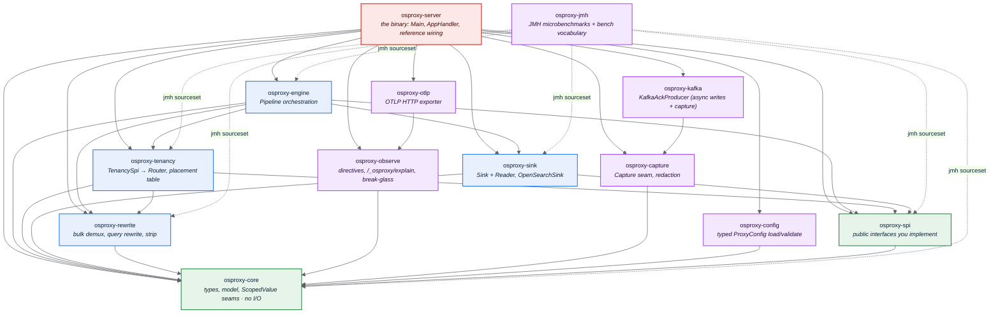

osproxy-java is a Gradle multi-project build of small, single-responsibility
modules. The golden rule is a **strict downward dependency direction**,
enforced per module by an ArchUnit test: lower modules never depend on
higher ones. `osproxy-core` depends on nothing in the build; only the
`osproxy-server` binary depends on everything.

## Module diagram

## Module responsibilities

| Module | Owns | Depends on |
|--------|------|------------|
| **osproxy-core** | Vocabulary types (`PartitionId`, `ClusterId`, `Target`, `Epoch`, `IndexName`…), the `Clock` seam, W3C `TraceContext`, and the `Tracing`/`ForwardHeaders` `ScopedValue` bindings. **No I/O.** | (nothing) |
| **osproxy-spi** | The public interfaces you implement: `TenancySpi`, the value types (`Placement`, `RequestCtx`, `RouteDecision`, `SpiException` hierarchy…). | core |
| **osproxy-rewrite** | NDJSON/`_bulk` demux, query-DSL partition-filter wrap, response field-strip, doc-id construction and inversion, partition extraction. | core |
| **osproxy-tenancy** | Adapts your `TenancySpi` into the engine's `Router` seam (`TenancyRouter`); the in-memory epoch-versioned `PlacementTable`; the SharedIndex partition-in-id invariant. | spi, core, rewrite |
| **osproxy-sink** | The `Sink` (write) and `Reader` (get/search/count/cursor/verbatim-forward) interfaces + `OpenSearchSink` (Helidon `WebClient`, per-cluster pools, circuit breaker) and `MemorySink` for tests. | spi, core |
| **osproxy-engine** | The request **`Pipeline`**: classify → resolve → write-gate → transform → dispatch → reverse-transform. The tenant-agnostic `PassthroughPolicy` short-circuit lives here too. | sink, tenancy, rewrite, spi, core |
| **osproxy-observe** | `Directive`/`DirectiveSet` (level/targeting/TTL/sampling), `ExplainDoc`/`ExplainStore`, `BreakGlassBuffer`, `DiagnosticSink` seam, `Metrics`, `SpanExporter` seam. | core |
| **osproxy-otlp** | `OtlpHttpExporter`: POSTs the pure OTLP/JSON span encoding to a collector, fire-and-forget with a bounded in-flight semaphore. | observe |
| **osproxy-capture** | The `Capture` seam for tenant-agnostic, full-fidelity traffic capture (`Capture.Record`, `Capture.redacting(...)`, `MemoryCapture`, `AckProducer`). | core |
| **osproxy-kafka** | `KafkaAckProducer` (acks=all, idempotent), the concrete broker-backed implementation both async writes and capture can use. | capture |
| **osproxy-config** | `ProxyConfig`: typed load/validate from Helidon `Config` (file + `OSPROXY_*` env), all defaults applied once, plus a named `Builder` for tests. | core |
| **osproxy-server** | The `osproxy-server` binary: `Main`, `AppHandler` (the Helidon ingress), `BearerAuth`, `ReferenceTenancy`, `PollingDirectiveStore`/`PollingPlacementStore`, `CryptoPosture` (FIPS engagement). | everything above |
| **osproxy-jmh** | JMH microbenchmarks (dimensional: doc size × bulk size × threads) and the `io.osproxy.bench` vocabulary (`LatencySummary`, `PerfProfile`, `FootprintProfile`) the e2e perf/soak tests in `osproxy-server` also use. | rewrite, engine, tenancy, spi, core, sink (jmh sourceset only) |

## Why this shape

- **The SPI is the narrow waist.** You compile against `osproxy-spi` (+
  `osproxy-core` types). Everything above it is the proxy's job; everything
  you provide is below the pipeline.
- **Seams, not frameworks.** `Sink`, `DirectiveSet.Store`, `SpanExporter`,
  `DiagnosticSink`, `Clock`, `CursorCodec` are interfaces with in-tree
  default implementations. You swap what you need; the rest stays at a
  near-zero-cost default (`NOOP` sinks, `InMemoryStore`).
- **The dependency DAG is a test, not a convention.** Each module has an
  ArchUnit test asserting only downward edges; a new module that tries to
  import upward fails `./gradlew check` immediately, not at review time.

→ [The SPI](/osproxy-java/05-spi-guide/)
