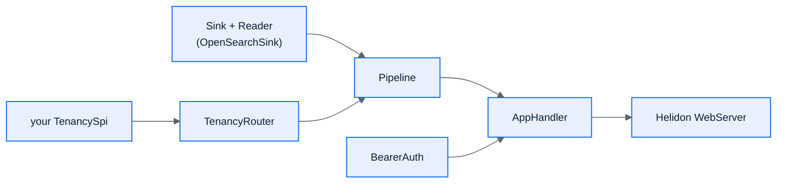

## How the pieces fit



## Minimal: a working proxy in ~20 lines

```java
var cluster = new ClusterId("primary");
var sink = new OpenSearchSink(Map.of(cluster, "http://localhost:9200"));
var tenancy = new ReferenceTenancy(cluster, new IndexName("shared"));

Pipeline pipeline = new Pipeline(new TenancyRouter(tenancy), sink, sink);
AppHandler handler = new AppHandler(pipeline, new BearerAuth(Map.of()));

WebServer server = WebServer.builder()
        .port(9200)
        .routing(handler::route)
        .build()
        .start();
```

With an empty token map, `BearerAuth` runs in dev mode: the `x-tenant`
header is trusted directly. Never ship that; the next section adds real
tokens.

## Fuller: the optional layers

```java
Pipeline pipeline = new Pipeline(
        new TenancyRouter(tenancy), sink, sink,
        cfg.cursorAffinityKey().map(HmacCursorCodec::new)
                .map(c -> (CursorCodec) c),          // scroll/PIT affinity
        asyncSink,                                    // Kafka-backed async writes
        passthrough);                                  // tenant-agnostic bypass

AppHandler handler = new AppHandler(
        pipeline, new BearerAuth(Map.of("secret-token", "acme")),
        cfg.maxBodyBytes(), cfg.requireTlsForMutation(), observability)
        .withDebugEndpoints(cfg.debugEndpoints())
        .withForwardPolicy(new ForwardPolicy(true, List.of()))
        .withAdminToken("directive-admin-secret")
        .withCapture(Capture.redacting(captureSink));
```

Every one of these is additive: leave any of them unset and the proxy
behaves exactly as the minimal example. This is the same builder-layering
discipline the Rust `osproxy` uses: advanced capability is off until you
turn it on.

## Serving with TLS / mTLS

```java
var tls = Tls.builder()
        .privateKey(Keys.builder().keystore(k -> k.keystore(Resource.create(certPath))).build())
        .clientAuth(clientCaPath.isPresent() ? TlsClientAuth.REQUIRED : TlsClientAuth.NONE)
        .build();

WebServer server = WebServer.builder()
        .port(9200)
        .tls(tls)
        .routing(handler::route)
        .build()
        .start();
```

Pair this with `osproxy.require-tls-for-mutation=true` so a body-mutating
request over a plaintext listener is refused rather than silently accepted.

## HTTP/2 and gRPC

HTTP/2 needs nothing beyond a dependency: add `helidon-webserver-http2` and
the `WebServer` above negotiates it automatically, on the same port, next to
HTTP/1.1. `AppHandler`'s routing already works unchanged across both.

gRPC is an additional `GrpcRouting` on the same builder:

```java
WebServer server = WebServer.builder()
        .port(9200)
        .routing(handler::route)
        .addRouting(GrpcRouting.builder()
                .intercept(new GrpcMetadataInterceptor())
                .service(new GrpcDocumentService(handler, auth).descriptor()))
        .build()
        .start();
```

`GrpcDocumentService` adapts the `DocumentService.Index` RPC into the same
`RequestCtx`/`AppHandler#dispatch` the REST ingest path uses, so a gRPC
caller gets the identical tenancy, auth, and observability behavior as a
REST one. `GrpcMetadataInterceptor` stashes the call's metadata into a
`Context` key so the handler can read the bearer token off it, the gRPC
analog of `ServerRequest.headers()`.

## You usually don't write `main` at all

`osproxy-server`'s `Main.start(ProxyConfig)` already assembles every layer
above from a `ProxyConfig`, wiring capture, async fan-out, FIPS, OTLP,
directive/placement polling, and the passthrough policy from config keys; the
gRPC routing is always on, no config key gates it, since it shares the REST
port and TLS setup rather than opening anything new. Run the binary
directly, or read `Main.java` as a worked example, then adapt it. It is
deliberately one linear method, not a framework you extend.

→ [Configuration](/osproxy-java/07-configuration/)
