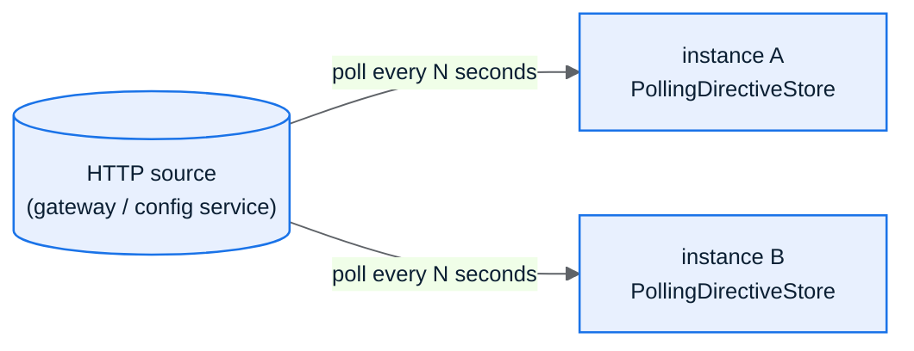

Every observability surface here is shape-only by construction: it can name
an endpoint kind, a status code, a request id, a trace id, never a tenant
value, a document body, or a credential.

## The shape-only causal trace

Every request produces an `ExplainDoc`: request id, W3C trace id, endpoint
kind, method, status, an error code when applicable, and duration. It is
built once per request in `AppHandler.record` and fed to three places at
once, the always-available explain store, the request log (if enabled),
and the break-glass tape (if a directive selected it).

## `GET /_osproxy/explain/{request_id}`

Looks up one request's `ExplainDoc` by the id echoed back on every response
via `x-osproxy-request-id`. A bounded ring (`ExplainStore`, default capacity
512) holds the most recent requests; an unknown id returns 404 with
`{"error":"unknown_request_id"}`.

## `GET /_osproxy/breakglass`

A second, smaller mechanism for a different problem: when a class of
request is failing and you don't know the request ids up front, publish a
directive with `ring_buffer: true` targeting that class (tenant/index/
principal/endpoint), and every matching request's `ExplainDoc` also lands
in a bounded, in-order tape (`BreakGlassBuffer`, default capacity 256),
readable as a plain JSON array, oldest first. Off (and free) until a
directive turns it on.

## Production posture: the `/_osproxy/debug-endpoints` switch

Both `/_osproxy/explain` and `/_osproxy/breakglass` can be turned off
(`osproxy.debug-endpoints=false`) so operational metadata is never exposed
unauthenticated in production. Disabled requests report
`{"error":"not_enabled"}` (404) rather than a bare 404, so an operator can
tell "turned off here" from "no such route." `/_osproxy/metrics` always
stays on regardless, it is the one surface meant to survive with `/debug`
off.

## Runtime diagnostics directives

A `Directive` raises (or silences) the recorded level for the requests it
matches, until it expires:

```json
{
  "id": "forensic-acme",
  "level": "verbose",
  "tenant": "acme",
  "index": "orders",
  "endpoint": "search",
  "principal": "user-42",
  "sample_per_mille": 1000,
  "ring_buffer": true,
  "ttl_seconds": 3600
}
```

Every field except `id`, `level`, and `ttl_seconds` is optional and
matches everything when absent. `sample_per_mille` samples deterministically
by request id, so the same 1% of requests record on every instance that
sees them, not a coin flip per instance.

### `DiagLevel` ladder

| Level | Records |
|-------|---------|
| `off` | Metrics only. |
| `shape` | Metrics + the explain store (the default baseline). |
| `verbose` | Metrics + explain + a JSON log line, when a log sink is wired (`osproxy.log-requests`). |

The **effective** level for one request is the baseline raised by the
highest-level matching directive, a silencing `off` directive only wins
when nothing raises the level above it.

### Two ways to apply a directive

**Fleet-wide, via the control plane**: `POST /_osproxy/admin/directives`
(token-gated by `osproxy.directive-admin-token`) replaces the active
`DirectiveSet`; `GET` on the same path introspects what this instance is
applying, and a published directive round-trips through introspection
verbatim (the same decoder validates both directions, fail-closed on any
unknown key).

**Per-request, via a signed header**: this Java port does not yet ship the
Rust project's HMAC-verified `X-Debug-Directive` single-request channel.
The admin endpoint (fleet-wide or single-instance) is the only publish path
today.

## The control plane

Fleet-wide directive and placement state polls from any HTTP source rather
than watching a distributed store:



`PollingDirectiveStore` and `PollingPlacementStore` decode fail-closed
(malformed or unknown-key documents are refused) and keep the last good
value on a fetch failure, so every instance polling the same URL converges
without a restart and a transient outage of the source never blanks the
fleet's directive set. A placement change bumps the affected partition's
epoch only on a real move, engaging the stale-write gate.

## `DiagnosticSink`: off-instance capture delivery

A proxy fleet serves a request on whichever instance the load balancer
picked, so a break-glass capture lands on that instance only: its local
ring is invisible to the others. `osproxy.log-diagnostic-captures=true`
also hands each `ring_buffer`-selected `ExplainDoc` to a `DiagnosticSink`
(the reference `StdoutDiagnosticSink` tags it `"kind":"diagnostic_capture"`
so a log collector can index it separately), so an external aggregator can
serve the capture by `trace_id` regardless of which instance handled it.
The seam's contract says implementations must not throw; `Observability`
enforces that at the one call site rather than trusting every
implementation to self-guard: a broken aggregator degrades diagnostics,
never request availability.

## OTLP export & distributed tracing

`osproxy.otlp-endpoint` turns on `OtlpHttpExporter`: one shape-only SERVER
span per request, POSTed to `{endpoint}/v1/traces`, with a bounded
in-flight semaphore that sheds spans behind a slow collector rather than
queuing unboundedly. W3C `traceparent`/`tracestate` propagate through a
`ScopedValue` (`Tracing.CURRENT`) bound once per request and read at the
sink's one upstream choke point: the proxy is a real hop in the trace
(new span id, same trace id), not a transparent relay.

## Forwarding client headers to the upstream

`osproxy.header-forwarding.enabled` (default `true`) forwards every client
header to the upstream, minus a mandatory, non-configurable strip list
(hop-by-hop headers, `host`, `content-length`, `accept-encoding`), on
every call the sink makes for a request: write, read, cursor, and
tenant-agnostic passthrough forward alike, via a `ForwardHeaders`
`ScopedValue` read at the same choke point as the trace header.
`osproxy.header-forwarding.deny` drops specific headers on top of the
mandatory set (e.g. deny `authorization` if you don't want the client's
own credential riding through to the cluster).

## `/_osproxy/metrics`, the always-on prod-safe surface

Pre-auth, unauthenticated, shape-only counts (`requests_total`,
`requests_ok`, `requests_client_error`, `requests_server_error`) as JSON.
The one introspection surface meant to stay reachable even when `/debug` is
off and credentials are broken.

## Structured request logs

`osproxy.log-requests=true` prints one `ExplainDoc` as JSON per request to
stdout when the effective `DiagLevel` is `verbose`, and raises the instance
baseline to `verbose` by default so logging "just works" without also
having to publish a directive.

## Where to go deeper

This page covers the mechanisms; [Choosing a Mode](/osproxy-java/10-choosing-a-mode/)
covers which knob lives at which layer (build/config/per-request/runtime),
and [Performance](/osproxy-java/11-performance/) has the measured cost of
leaving all of this on versus off.

→ [Async Fan-out Writes](/osproxy-java/09-async-clients/)
