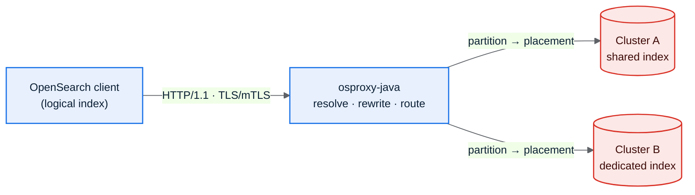

osproxy-java is an OpenSearch routing proxy you run as a Java 25 / Helidon SE
library. You implement a few interfaces (the SPI), assemble the pipeline in
`main`, and put it in front of one or more OpenSearch clusters. It targets low
latency on virtual threads, a bounded memory footprint, and observability built
for a fleet operator (or an LLM agent) to debug without SSHing into a box to
read code.

If you are new, read [Overview](/osproxy-java/01-overview/), then go straight to
[Wiring It Together](/osproxy-java/06-wiring-example/) for code you can run.

## Contents

| # | Guide | What it covers |
|---|-------|----------------|
| 1 | [Overview & Intent](/osproxy-java/01-overview/) | What osproxy-java is, the problem it solves, what it deliberately leaves out. |
| 2 | [Requirements & NFRs](/osproxy-java/02-requirements-and-nfrs/) | Functional scope and the performance, reliability, security, and traceability budgets a release must meet. |
| 3 | [Architecture](/osproxy-java/03-architecture/) | The request lifecycle end to end, with diagrams. |
| 4 | [Components (Module View)](/osproxy-java/04-components/) | Every Gradle module, what it owns, and the dependency direction. |
| 5 | [The SPI](/osproxy-java/05-spi-guide/) | The interfaces you implement (`TenancySpi`, `BearerAuth`, `Sink`, `Reader`, `Router`) with examples. |
| 6 | [Wiring It Together](/osproxy-java/06-wiring-example/) | A full program assembling a working proxy. |
| 7 | [Configuration](/osproxy-java/07-configuration/) | Every setting, its `OSPROXY_*`/`osproxy.*` key, default, and meaning. |
| 8 | [Observability & Control Plane](/osproxy-java/08-observability/) | Tracing, `/_osproxy/explain`, break-glass, runtime directives, OTLP, metrics, and the fleet-debugging model. |
| 9 | [Async Fan-out Writes](/osproxy-java/09-async-clients/) | The `202`/`op_id` async write mode, mode negotiation, and how a client handles it. |
| 10 | [Choosing a Mode](/osproxy-java/10-choosing-a-mode/) | Tenanted vs agnostic, sync vs async, capture, FIPS, which layer each knob lives at (build / config / per-request / runtime). |
| 11 | [Performance](/osproxy-java/11-performance/) | Measured throughput/latency by concurrency, footprint under soak, and a controlled comparison against the Rust `osproxy` sibling project. |

## At a glance

A client sends traffic addressed to a logical index. osproxy-java reads the
partition (tenant) from the request, looks up that partition's placement, and
routes to exactly one physical cluster and index, rewriting the body and query
so the tenant sees an isolated view of its own data.

## What shapes the design

It is a library, not a platform. There is no dynamic plugin loading. You depend
on `osproxy-spi`, implement interfaces, and the compiler checks your wiring.

Every advanced capability is off until you turn it on. TLS/mTLS, OTLP export,
runtime diagnostics, tenant-agnostic passthrough, and cursor affinity are
builder layers a minimal deployment never touches. Set nothing and you still
get a working proxy on Helidon SE's default virtual-thread executor.

The defaults lean safe. Mutating requests are refused over cleartext when
configured to require it, isolation fails closed, and diagnostics never emit a
tenant value. Every request produces a shape-only causal trace good enough to
diagnose a failure without opening the code.

## Relationship to the Rust `osproxy`

osproxy-java is a from-scratch Java 25 / Helidon SE port of
[`osproxy`](https://github.com/huyz0/opensearch-proxy), a Rust library with the
same job. The two are independent implementations of the same design: same
request model, same endpoint matrix, same observability surfaces, ported
milestone by milestone rather than translated line by line. Where this guide
says "the proxy," it means osproxy-java; it does not assume you have read the
Rust project's docs.

## Going deeper

This guide is the entry point for using the proxy. It does not cover
day-to-day contribution workflow or Gradle module internals beyond what a
consumer needs — see the module Javadoc and `README.md` in each
`osproxy-*` directory for that.
